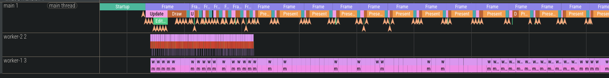

# love-profiler
A convenience wrapper around the built-in luajit profiler that spits out json files perfetto can read.

Built for LOVE games.

## How to use?
define some zones, start it, finish it and a `trace.json` file will be dropped in your save directory.
```lua

local Profiler = require("profiler")

function love.update(dt)
    Profiler:zone("Update")
    
    -- update stuff here
    
    Profiler:zone_pop()
end

function love.draw()
    Profiler:zone("Draw")
    
    -- draw stuff here
    
    Profiler:zone_pop()
end

-- Toggle profiler on/off and save trace when stopped
-- Call this when you want to stop profiling and save results
function love.keypressed(key)
    if key == "f1" then
        Profiler:toggle() -- Stops and saves to trace.json
    end
end
```

### love.thread
It (partially) works with LOVE threads too. 

```lua
local t = love.thread.newThread([[
local Profiler = require("profiler")

-- Start profiler with thread name
Profiler:start("i1", "worker-1")

local iterations = 0

while iterations < 100 do
    Profiler:zone("worker_iteration")
    
    Profiler:zone("computation")
    local result = 0
    for i = 1, 100000 do
        result = result + math.sqrt(i) * math.sin(i)
    end
    Profiler:zone_pop()
    
    Profiler:zone_pop()
    
    -- Flush events to main thread
    Profiler:flush_to_channel()
    iterations = iterations + 1
end

Profiler:flush_to_channel()
]])

t:start()
```

However the luajit profiler has a limitation where it will only *sample* one thread!

## View in perfetto
* Open up [perfetto](https://ui.perfetto.dev/)
* Open trace file
* Choose your trace file (in your games save directory)

Samples will appear as instant slices (the arrows) and display the stacktrace for that sample as an arg.


